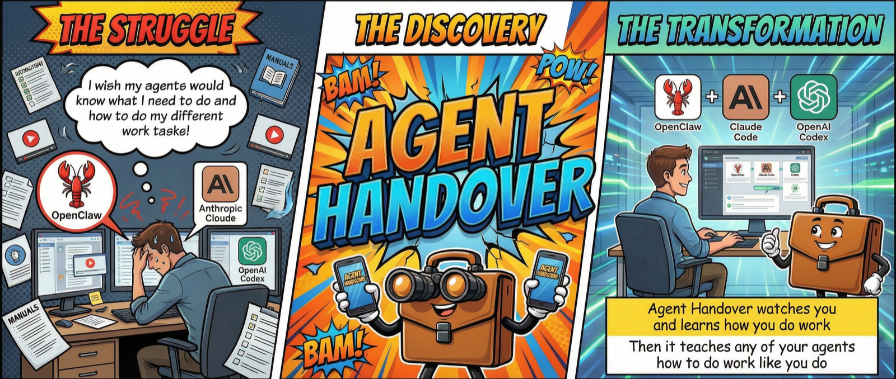

<p align="center">
  
</p>

<h1 align="center">AgentHandover</h1>

<p align="center">
  <strong>Work once. Hand over forever.</strong>
</p>

<p align="center">
  <a href="https://github.com/sandroandric/AgentHandover/releases/latest"></a>
  
  
  
</p>

<p align="center">
  <a href="#demo">Demo</a> &middot;
  <a href="#quickstart">Quickstart</a> &middot;
  <a href="#what-you-can-automate">Use Cases</a> &middot;
  <a href="#what-a-skill-looks-like">What a Skill Looks Like</a> &middot;
  <a href="#how-it-works">How It Works</a> &middot;
  <a href="#connect-your-agent">Connect Your Agent</a> &middot;
  <a href="#install">Install</a> &middot;
  <a href="#privacy">Privacy</a>
</p>

---

<p align="center">
  
</p>

## Demo

<p align="center">
  <a href="https://youtu.be/3nGH3rYbgfY">
    
  </a>
</p>

<p align="center"><a href="https://youtu.be/3nGH3rYbgfY">Watch the full demo on YouTube</a></p>

### Show it once. Hand it off forever.

AgentHandover watches how you work on your Mac, turns your workflows into reusable **Skills**, and lets agents like **Claude Code**, **OpenClaw**, **Hermes**, **Codex**, or any MCP-compatible tool execute them the way you do it.

Each Skill captures the *what*, the *why*, and the *how* — steps, strategy, decision logic, guardrails, and your writing voice. And they're **self-improving**: agents report back after every execution, successes boost confidence, deviations become new decision branches, failures trigger corrections.

You already know how to do your work. Now your agents can too.

## Why this matters

Getting an AI agent to do real work today means writing prompts or hand-crafting skills — brittle, time-consuming, and stale the moment your process changes. Worse, those skills capture *what* you do, not *how* you decide.

AgentHandover flips it. Instead of telling the agent how you work, you just work. The system watches, infers the strategy behind your clicks, and produces Skills with the *why* built in — selection criteria, guardrails, decision branches, your voice. Because agents report back after every execution, Skills get better the more they're used.

Less time writing prompts. More time doing work that matters.

## What you can automate

AgentHandover learns whatever you do repeatedly on your Mac. A few examples of the kinds of workflows it handles well:

- **Research routines** — Your way of scanning sources, extracting key facts, and composing a summary.
- **Community engagement** — Daily check-ins on Reddit, Discord, or forums with your selection rules and voice.
- **Support triage** — How you read a ticket, check the dashboard, pick a macro, and draft a reply.
- **Data extraction** — Pulling structured data from a dashboard, CRM, or spreadsheet the way you do it.
- **Ops checklists** — Deploys, releases, status updates — your actual sequence with the decisions you make.
- **Personal skill library** — Any repetitive workflow you don't want to explain to an agent twice.

If it's a workflow you've done three times and will do again, it belongs in a Skill.

## Quickstart

1. **Install.** Download the latest `.pkg` from [Releases](https://github.com/sandroandric/AgentHandover/releases) and double-click. The onboarding app walks you through permissions and auto-downloads the best AI model for your Mac.
2. **Record a task.** Click **Record** in the menu bar, name it (e.g. *"Daily Reddit marketing"*), perform it once, click **Stop**.
3. **Answer 1-3 questions.** AgentHandover asks from the agent's perspective — *"What determines which posts you engage with?"*
4. **Review and approve.** Open the Skill in the menu bar app, check the steps/strategy/guardrails, click **Approve for Agents**.
5. **Connect your agent.** `agenthandover connect claude-code` (or `codex` / `openclaw`). One command.
6. **Run it.** In Claude Code, type `/reddit-community-marketing`. The agent executes your workflow.

That's the whole loop. Record once, hand off forever.

## What a Skill Looks Like

Here's an illustrative example of what a Skill looks like:

```
Reddit Community Marketing
Daily engagement workflow - 6 steps - 4 sessions learned

STRATEGY
Browse target subreddits for posts about marketing tools or growth
hacking. Engage with high-signal posts (10+ comments, posted within
48h, not promotional). Write authentic replies that acknowledge the
problem, share personal experience, and softly mention the product.

STEPS
1. Open Reddit and navigate to r/startups
2. Scan posts - skip promotional, skip < 10 comments
3. Open high-signal post and read top comments
4. Write reply: acknowledge -> experience -> mention product
5. Submit and verify not auto-removed
6. Repeat for r/marketing, r/growthacking (max 5/day)

SELECTION CRITERIA              GUARDRAILS
- Posts with 10+ comments       - Max 5 replies per day
- Not promotional or competitor - Never identical phrasing
- Posted within 48 hours        - Never reply to own posts
- Relevant to [product category]- Empathy-first tone always

VOICE & STYLE
Tone: casual | Sentences: short and punchy | Uses emoji
> Hey great point about the engagement metrics! We should
> def try that approach with the subreddit

~15 min daily - 9-10am                     Confidence: 89%
```

Skills follow the same format as Claude Code's native skills -- same frontmatter, same markdown structure -- but go further. Hand-written skills say "do X then Y." AgentHandover Skills include the strategy behind the steps, selection criteria, guardrails, your voice, and evidence-backed confidence from real observations. No hand-written skill has that.

## How It Works

### Two ways to teach

**Focus Recording** -- Click Record in the menu bar, name the task, perform it, click Stop. AgentHandover asks 1-3 targeted questions from the agent's perspective ("What determines which posts you engage with vs. skip?"), then generates a complete Skill. Best for workflows you want to hand off right now.

**Passive Discovery** -- Just work normally. AgentHandover recognizes recurring workflows across sessions using semantic similarity, accumulates observations, and when it has enough evidence, runs behavioral analysis to extract the strategy, decisions, and patterns behind your actions -- then generates a Skill automatically. You don't have to do anything.

### You stay in control

Every Skill starts as a draft in your menu bar app. Six gates must pass before an agent can execute:

| Gate | What it checks |
|------|---------------|
| **Lifecycle** | You reviewed and promoted it through each stage (Observed > Draft > Reviewed > Verified > Agent Ready) |
| **Trust** | You authorized the agent to execute, not just observe |
| **Freshness** | The Skill was observed recently -- stale Skills auto-demote |
| **Preflight** | Required apps are running, no blocked domains |
| **Evidence** | Enough observations, high confidence, no contradictions |
| **Execution history** | Past success rate -- 3+ failures auto-demote |

The system suggests promotions based on evidence. You decide.

## The Knowledge Base

Everything AgentHandover learns lives in a local knowledge base on your machine. It's not a flat list of files -- it's an active intelligence layer that gets smarter the more you work.

**Vector store** -- Every observation is embedded (nomic-embed-text, 768d) so the system finds similar workflows by meaning, deduplicates Skills that describe the same task differently, and links activity across sessions. Optional image embeddings (SigLIP, 1152d) capture what your screen looked like.

**Voice profiles** -- Your writing style accumulates per workflow and strengthens over sessions. One reply is a guess. Twenty replies is a fingerprint the agent can match. Casual on Reddit, formal in client emails -- the system knows the difference.

**User profile** -- Aggregated across all workflows: your tools, working hours, communication patterns, and overall writing style. Agents read this to adapt to you.

**Semantic search** -- Agents can search the knowledge base by meaning via the MCP server or REST API. "Find something about deploying" returns your staging deployment Skill even if it's titled "Push to Prod."

## Execution Feedback Loop

Most tools stop at "here's a procedure, good luck." AgentHandover closes the loop. When an agent executes a Skill, it reports back what happened -- and the Skill gets better.

**How it works**: Every Skill includes an execution protocol. The agent calls `report_execution_start` before beginning, `report_step_result` after each step, and `report_execution_complete` when done. AgentHandover processes the results:

- **Success** -- Confidence goes up. Freshness confirmed. Timing updated via exponential moving average.
- **Deviation** -- The system tracks what the agent actually did vs. what was expected. After 2+ deviations on the same step, it suggests a decision branch.
- **Failure** -- Confidence drops. After 3 failures in 7 days, the Skill auto-demotes from agent-ready.

Skills don't just describe your workflows -- they learn from every execution and improve over time.

### One-click agent pairing

The menu bar app detects installed agents (Claude Code, Cursor, Windsurf) and connects them with one click -- writes the MCP config automatically. No terminal, no config files.

## Connect Your Agent

### MCP Server (recommended)

One config line, any agent. Works with Claude Code, Cursor, Windsurf, and any MCP-compatible tool.

```json
{
  "mcpServers": {
    "agenthandover": {
      "command": "agenthandover-mcp"
    }
  }
}
```

Exposes 8 tools:

| Tool | What it does |
|------|-------------|
| `list_ready_skills` | Skills ready for execution (all gates passed) |
| `get_skill(slug)` | Full Skill with steps, strategy, voice, guardrails + execution protocol |
| `search_skills(query)` | Semantic search -- find Skills by meaning |
| `list_all_skills` | All Skills including drafts |
| `get_user_profile` | User's tools, working hours, writing style |
| `report_execution_start(slug)` | Tell AgentHandover you're starting to execute a Skill |
| `report_step_result(id, step)` | Report each step's outcome (completed or deviated) |
| `report_execution_complete(id)` | Report final status -- triggers Skill improvement |

### Claude Code

```bash
agenthandover connect claude-code
```

Skills appear as `/slash-commands`. Type `/reddit-community-marketing` and Claude Code gets the full Skill.

### Codex

```bash
agenthandover connect codex
```

Generates `AGENTS.md` with all agent-ready Skills, strategy, guardrails, and voice guidance.

### OpenClaw

```bash
agenthandover connect openclaw
```

Skills auto-sync to the OpenClaw workspace. Nothing to configure.

### Hermes

```bash
agenthandover connect hermes
```

Installs your Skills into `~/.hermes/skills/agenthandover/<slug>/SKILL.md` for [Hermes](https://github.com/NousResearch/hermes-agent), Nous Research's self-improving agent. Hermes walks `~/.hermes/skills/` looking for `SKILL.md` files (agentskills.io / anthropic-skills convention), so AgentHandover Skills drop in directly — `/skills` lists them, `/<skill-name>` runs them. For live semantic search and the execution-feedback loop, also add the MCP server to `~/.hermes/config.yaml`:

```yaml
mcp:
  servers:
    agenthandover:
      command: "agenthandover-mcp"
```

### REST API

Already running on localhost:9477:

```bash
curl http://localhost:9477/ready              # Agent-ready Skills
curl http://localhost:9477/bundle/my-workflow  # Full handoff bundle
curl -X POST http://localhost:9477/search/semantic \
  -d '{"query": "deploy to production"}'      # Semantic search
```

## Install

### Download and run

Download the latest `.pkg` from [**Releases**](https://github.com/sandroandric/AgentHandover/releases) and double-click.

The onboarding app walks you through: permissions, AI model downloads (auto-recommends the best model for your Mac's RAM), Chrome extension, and your first recording.

<details>
<summary><strong>Developer / advanced install</strong></summary>

### CLI setup

```bash
agenthandover doctor     # Verify prerequisites
agenthandover start all  # Start daemon + worker
```

### AI Models

AgentHandover auto-detects your Mac's RAM during onboarding and recommends the best model tier:

| RAM | Tier | Model | Download |
|-----|------|-------|----------|
| 8 GB | Standard | Qwen 3.5 (2B + 4B) | ~6 GB |
| 16 GB | Recommended | Gemma 4 E4B | ~10 GB |
| 24 GB | Performance | Gemma 4 E4B Q8 | ~12 GB |
| 48 GB+ | Max Quality | Gemma 4 31B | ~20 GB |

Gemma 4 models require Ollama 0.20.0+. All models run fully local via Ollama.

```bash
# Or pull manually:
ollama pull gemma4              # Recommended for 16 GB+ (~10 GB)
ollama pull nomic-embed-text    # Semantic search (~274 MB)
```

### Chrome extension

Open `chrome://extensions` > Enable Developer Mode > Load unpacked > select the extension directory shown by `agenthandover doctor`.

### Homebrew (cask)

```bash
brew tap sandroandric/agenthandover
brew install --cask agenthandover
```

The cask downloads the signed, notarized `.pkg` from GitHub releases and runs Apple's installer — you get bit-identical behavior to the direct-download path, so all TCC (Accessibility + Screen Recording), launchd, and Ollama onboarding flows work the same. Uninstall cleanly with `brew uninstall --cask agenthandover` (use `--zap` to also remove `~/Library/Application Support/agenthandover`).

### Source build (Rust, Node.js 18+, Python 3.11+, Swift / Xcode CLT)

```bash
git clone https://github.com/sandroandric/AgentHandover.git && cd AgentHandover
bash scripts/build-pkg.sh     # builds daemon + CLI + worker + extension + app,
                              # then packages a signed .pkg at target/
sudo installer -pkg target/AgentHandover-*.pkg -target /
```

`scripts/build-pkg.sh` is the single source of truth for builds — it's what the GitHub releases pipeline runs. The `justfile` has individual `just build-daemon`, `just build-cli`, etc. recipes if you need to rebuild a single component during development.

</details>

### Choose your AI model

AgentHandover defaults to local models via Ollama (Gemma 4 for 16 GB+ Macs, Qwen 3.5 for 8 GB) -- free, fast, private. Six backends supported:

| Backend | Best for |
|---------|----------|
| **Ollama** (default) | Local, free, private |
| **MLX** | Fastest on Apple Silicon |
| **llama.cpp** | Cross-platform local |
| **OpenAI / Anthropic / Google** | Highest quality (remote, opt-in) |

Switch via `config.toml` or `agenthandover setup --vlm`.

## The Menu Bar App

AgentHandover lives in your menu bar:

- **Status** -- daemon and worker health
- **Today's stats** -- events captured, annotations completed, Skills generated
- **Attention items** -- Focus Q&A questions waiting, drafts ready for review
- **Record** -- one click to start a focus recording
- **Workflows** -- browse all Skills, approve drafts, see confidence and evidence
- **Digest** -- daily summary of what was learned and what needs attention

Review the strategy, steps, and guardrails. Click "Approve for Agents" when it looks right. One click. No Skill reaches agents without your sign-off.

## Privacy

Everything runs on your machine:

- **Local-first.** VLM inference via Ollama. Cloud APIs are opt-in with explicit consent.
- **Screenshots are temporary.** Deleted after VLM annotation. Only structured text survives. Image embeddings computed before deletion.
- **Auto-redaction.** API keys, tokens, passwords, credit card numbers scrubbed before storage.
- **Secure field exclusion.** Password and credit card inputs are never captured.
- **Knowledge base is local.** Vector store, voice profiles, and all Skills live on your machine. Never uploaded.
- **Encryption at rest.** Artifacts use zstd + XChaCha20-Poly1305.
- **Configurable retention.** Raw events pruned at 14 days. Valuable evidence extracted and preserved permanently before expiry.
- **No telemetry.** Nothing phones home. Ever.

<details>
<summary><strong>The 11-stage intelligence pipeline (technical)</strong></summary>

This is not a screen recorder with ChatGPT on top. AgentHandover runs an 11-stage pipeline that turns raw screen activity into agent-ready Skills:

| Stage | What it does |
|-------|-------------|
| **1. Screen capture** | Half-resolution screenshots, deduplicated by perceptual hashing (70% of frames are duplicates and get dropped) |
| **2. VLM annotation** | Local AI model (Gemma 4 or Qwen 3.5) reads each frame -- what app, what URL, what you're doing, what you'll do next |
| **3. Activity classification** | 8-class taxonomy separates work from noise. Your expense filing is "work." Your YouTube break is "entertainment." |
| **4. Text embedding** | Every annotation embedded into a vector knowledge base (nomic-embed-text, 768d) for semantic matching |
| **5. Image embedding** | Optional SigLIP embeddings (1152d) capture what your screen looked like -- find visually similar screens even when text differs |
| **6. Semantic clustering** | Groups related activity by meaning, not keywords. "Deploy to staging" matches "push to stage environment." |
| **7. Cross-session linking** | Connects the same workflow across days and interruptions using vector cosine similarity |
| **8. Behavioral synthesis** | After 3+ observations: extracts strategy, selection criteria, content templates, guardrails, decision branches, and timing patterns -- now grounded in the user's profile (tools, role, accounts) |
| **9. Voice analysis** | Captures your writing style from typed text -- formality, sentence length, vocabulary, emoji. Per workflow. Strengthens over sessions. |
| **10. Skill generation** | Produces a canonical Skill with semantic dedup (won't create duplicates even if you describe the same workflow differently) |
| **11. Human review** | You approve before any agent can execute. Six readiness gates must pass. Nothing auto-promotes. |

Every stage runs locally on your Mac. No cloud APIs required.

</details>

<details>
<summary><strong>Architecture</strong></summary>

```
                              You work normally
                                    |
                                    v
Chrome Extension -----> Daemon (Rust) ---SQLite WAL---> Worker (Python)
  DOM snapshots           Screenshots                     |
  Click targets           OS events                       v
  Form field IDs          Clipboard                  11-stage pipeline:
                          Perceptual dedup           VLM annotation
                                                     Activity classification
                    Menu Bar App (SwiftUI)            Text + image embedding
                    Status - Record - Workflows      Semantic clustering
                    Digest - Focus Q&A               Behavioral synthesis
                                                     Voice analysis
                                                     Skill generation
                                                          |
                                                          v
                                              +------------------------+
                                              |    Knowledge Base      |
                                              |                        |
                                              |  Skills (v3 schema)    |
                                              |  Vector store (768d)   |
                                              |  Image vectors (1152d) |
                                              |  Voice profiles        |
                                              |  User profile          |
                                              |  Evidence + history    |
                                              +-----+------+-----------+
                                                    |      |
                                      +-------------+      +------------+
                                      v              v                  v
                                MCP Server     Claude Code       OpenClaw SOPs
                                (any agent)    /slash-commands    (auto-sync)
                                Codex          REST API
                                AGENTS.md      localhost:9477
```

| Component | Language | Role |
|-----------|----------|------|
| **Daemon** | Rust | Always-on observer -- screenshots, OS events, clipboard, dedup |
| **Worker** | Python | Intelligence -- 11-stage pipeline, vector KB, behavioral synthesis, voice analysis, lifecycle, export |
| **Extension** | TypeScript | Chrome MV3 -- DOM snapshots, click targets, form field context, ARIA labels |
| **CLI** | Rust | Service management, focus recording, agent connection |
| **App** | SwiftUI | Menu bar -- status, recording, workflows, digest, Focus Q&A |
| **MCP Server** | Python | Universal agent interface -- 5 tools + 3 resources via MCP protocol |
| **Knowledge Base** | SQLite + JSON | Vector store, Skills, voice profiles, user profile, evidence |

</details>

<details>
<summary><strong>CLI reference</strong></summary>

| Command | Description |
|---------|-------------|
| `agenthandover status` | Service health and stats |
| `agenthandover start all` | Start daemon + worker |
| `agenthandover stop all` | Stop services |
| `agenthandover focus start "title"` | Record a workflow |
| `agenthandover focus stop` | Stop recording |
| `agenthandover skills list` | List all Skills |
| `agenthandover skills approve <slug>` | Approve for agents |
| `agenthandover skills promote <slug> <state>` | Promote lifecycle |
| `agenthandover connect <agent>` | Set up agent integration |
| `agenthandover doctor` | Pre-flight health check |
| `agenthandover watch` | Live dashboard |
| `agenthandover logs worker -f` | Follow worker logs |

</details>

## Uninstall

```bash
agenthandover uninstall              # Remove services, keep data
agenthandover uninstall --purge-data # Remove everything
```

## Contributing

AgentHandover is early and unusually high-leverage for contributors. The prompt files, agent connectors, and skill templates are all plain text that anyone can read, run, and improve — a careful hour of prompt tuning can measurably change the quality of every Skill the tool produces for every user.

### Ways to help (no code required)

- **Share a Skill you actually use.** Record a real workflow, review the generated Skill, and post it in [Discussions → Show & Tell](https://github.com/sandroandric/AgentHandover/discussions). Real workflows beat synthetic examples and become the reference library everyone learns from.
- **Report bad outputs.** Did a generated Skill miss a step, add a redundant click, or misread your strategy? Open an [issue](https://github.com/sandroandric/AgentHandover/issues) with the Skill + what it should have been. The prompts get tuned directly from this feedback.
- **Bug reports from real usage.** Everything is logged locally so reproductions are usually easy. The more unusual your Mac setup, model tier, or workflow, the more valuable the report.
- **Answer questions in [Discussions](https://github.com/sandroandric/AgentHandover/discussions).** Anyone who's used the tool for more than a week has context new users need.

### Code contributions we'd love

- **New agent connectors.** Follow the pattern in [`worker/src/agenthandover_worker/agent_connect.py`](worker/src/agenthandover_worker/agent_connect.py). Cursor, Windsurf, Cline, Aider, RooCode, and any agent that reads Claude Code-format skills or MCP are straightforward — the Hermes and Codex connectors are each under 150 lines.
- **New VLM backends.** Six supported today (Ollama, MLX, llama.cpp, Anthropic, Google, OpenAI-compat) in [`worker/src/agenthandover_worker/backends/`](worker/src/agenthandover_worker/backends/). LocalAI, LM Studio, vLLM, and any OpenAI-compatible endpoint are easy drop-ins.
- **Prompt engineering.** The prompts in [`sop_generator.py`](worker/src/agenthandover_worker/sop_generator.py) and [`behavioral_synthesizer.py`](worker/src/agenthandover_worker/behavioral_synthesizer.py) drive the entire output quality. If you see a way to make them more precise, more robust, or better at handling your language, send a PR.
- **Browser extension ports.** Chrome / Chromium / Brave / Edge / Arc / Comet are supported. Firefox and Safari are wide open.
- **Privacy review.** This is a local-first tool that handles sensitive data. Extra eyes on [`crates/common/src/redaction.rs`](crates/common/src/redaction.rs) and the artifact encryption path are genuinely wanted.

### Getting started

If you're not sure where to begin, open a [Discussion](https://github.com/sandroandric/AgentHandover/discussions) with a rough idea — it's faster to shape something together than to send a PR cold. Small PRs get reviewed quickly. If your contribution is non-trivial, running `just test` and `cargo test` before opening the PR saves a review round-trip.

Direct line for anything that doesn't fit: [sandro@sandric.co](mailto:sandro@sandric.co).

## Contact

[sandro@sandric.co](mailto:sandro@sandric.co)

## Changelog

### v0.2.2 (2026-04-11)

Small maintenance release that cleans up a lingering v0.2.0 → v0.2.1 upgrade wart and ports the v0.2.1 "rich observations" grounding to the daily re-synthesis path.

**Upgrade safety**
- Preinstall script now explicitly removes `com.agenthandover.daemon.plist` from every location v0.2.0 may have installed it (`~/Library/LaunchAgents`, `/usr/local/lib/agenthandover/launchd`, `/Library/LaunchAgents`, `/Library/LaunchDaemons`). macOS's `pkg` installer only replaces files that are in the new Bom, so a stale plist from v0.2.0 would otherwise survive in-place upgrades forever — fixes [#1](https://github.com/sandroandric/AgentHandover/issues/1) for anyone still on v0.2.0.
- `agenthandover start` / `agenthandover stop` now spawn the daemon directly via `Process()` (matching what the menu bar app already does) instead of calling `launchctl load` on a plist that no longer ships. The worker still uses launchd.

**Behavioral synthesis — rich observations in daily re-synthesis path**
- The daily re-synthesis loop now looks up the real events for each focus-derived observation from the SQLite store, parses `scene_annotation_json`, and builds rich per-frame dicts (`email_addresses`, `urls`, `typed_text`, `visible_values`, `active_element`, `compose`) via `FocusProcessor._build_pre_analysis_obs` — the same grounding focus recordings already used in v0.2.1. The synthesizer prompt's TIMELINE EVIDENCE section now has verbatim text to quote for focus-derived procedures, not just abstract SOP steps.
- Procedures without a focus session id fall back to the old abstracted-step path — no regression.

2997 Python tests pass. No schema changes, no breaking changes.

### v0.2.1 (2026-04-10)

**Critical bugfixes for focus recordings + behavioral synthesis** — recommended upgrade for everyone on v0.2.0.

**Focus recording reliability**
- Menu bar icon now appears reliably (`LSUIElement=true` added so SwiftUI `MenuBarExtra` registers correctly)
- Fixed worker startup crash from a `v2_cfg` scoping bug that prevented the worker from starting at all on Python 3.14
- Fixed race where the passive annotation loop would delete focus session JPEGs before the focus_processor could use them — focus recordings would silently fail with "missing_screenshot"
- Clipboard events now correctly attach to the snapshot BEFORE the copy (the source app), so Copy steps get the right attribution instead of being labelled with whatever app the user switched to next

**SOP quality — concrete intent extraction**
- VLM annotation prompt now receives the daemon's high-confidence OCR text as ground truth — Gemma stops misreading email addresses and small UI text from half-res screenshots
- Behavioral synthesizer now requires a concrete `goal` field naming the artifact, recipient, and trigger (no more abstract *"research-to-communication cycle"* — actual intent like *"compile domain leads from Afternic into Google Doc 'New leads'"*)
- Synthesizer prompt now includes per-frame TIMELINE EVIDENCE with verbatim text (emails, URLs, typed content, active UI elements) so the model can quote real data when extracting strategy and guardrails
- Annotation prompt asks for explicit compose-window fields (recipient, subject, body_first_line) so email workflows extract the actual values instead of *"drafting an email"*
- Behavioral confidence jumped from 0.20 → 0.95 in tested workflows

**Hermes agent integration**
- New `agenthandover connect hermes` command installs Skills into `~/.hermes/skills/agenthandover/<slug>/SKILL.md` in the agentskills.io format that [Hermes](https://github.com/NousResearch/hermes-agent) reads natively
- Skills appear in Hermes via `/skills` and `/<skill-name>`

**Behavioral analysis — user-aware synthesis**
- Behavioral analysis now reads the inferred user profile (primary apps, stack, accounts, working hours, writing style) and injects it into the synthesis prompt — strategy and guardrails are grounded in WHO the user actually is, not an abstract "user"
- Cold-start fallback: first-time users with no profile yet still get a lightweight "observed apps in this workflow" context derived from the current recording
- Heuristic role hint (developer / designer / founder / PM) generated from tools + accounts

**Other**
- Fixed `clipboard_linker` reading the wrong JSON field — copy/paste pairs in passive discovery now actually link for the first time since the schema migration
- Test fixtures corrected — historical bug where production code and test fixtures both encoded the wrong daemon event format and silently agreed
- Sharper SOP rules for accidental click detection, typo corrections, copy/paste guidance
- Removed stale `com.agenthandover.daemon.plist` from the installer (it referenced a path that no longer exists; fixes [#1](https://github.com/sandroandric/AgentHandover/issues/1))
- 3000+ tests passing

### v0.2.0 (2026-04-03)

**Gemma 4 support and model tier system**
- Auto-detects RAM and recommends optimal model tier during onboarding (8 GB to 48 GB+)
- Gemma 4 E4B as recommended model for 16 GB+ Macs -- higher annotation reliability, richer SOP generation with thinking mode
- Per-model optimal settings (system prompts, thinking levels, sampling parameters) applied automatically
- Ollama version check -- warns if Gemma 4 selected but Ollama < 0.20.0

**Pipeline improvements**
- Vector embeddings wired into all pipeline stages (procedures, daily summaries, profile)
- Behavioral pre-analysis enriched with app names and URLs -- strategy extraction now succeeds on first call
- Strategy fallback: if post-SOP behavioral call fails, pre-analysis strategy is preserved
- Truncated JSON repair in behavioral synthesizer

**UI and UX**
- FAQ window accessible from menu bar with 15 Q&A items across 5 sections
- Daily Digest shows task intents and app usage (was showing empty bullets)
- Focus Q&A window comes to front instead of being buried behind Workflows
- Compact menu bar quick links (Skills, Digest, FAQ) -- no more truncation
- Stale daemon PID detection prevents "Observe Me" from silently failing

**Agent integration**
- Fixed MCP server and agent_connect knowledge base paths
- CLI skills list shows only approved SOPs (was showing 29 passive noise entries)
- Slash commands per procedure with full steps, strategy, Q&A, execution protocol
- agenthandover-mcp symlinked to /usr/local/bin/ in pkg installer

**Browser extension**
- Added host_permissions for MV3 content script injection
- Comet browser support alongside Chrome, Chromium, Brave, Edge, Arc

**Reliability**
- postinstall: chown venv before pip reinstall (fixes root-owned dist-info blocker)
- 252 Rust tests, 2955 Python tests passing

## License

[Apache 2.0](LICENSE)

## Star History

<a href="https://www.star-history.com/?repos=sandroandric%2FAgentHandover&type=date&legend=top-left">
 <picture>
   <source media="(prefers-color-scheme: dark)" srcset="https://api.star-history.com/image?repos=sandroandric/AgentHandover&type=date&theme=dark&legend=top-left" />
   <source media="(prefers-color-scheme: light)" srcset="https://api.star-history.com/image?repos=sandroandric/AgentHandover&type=date&legend=top-left" />
   
 </picture>
</a>
